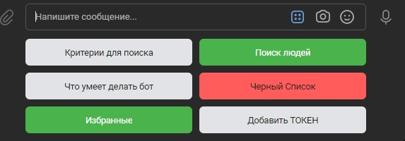

# КОМАНДНАЯ КУРСОВАЯ РАБОТА ПО СОЗДАНИЮ СЕРВИСА ЗНАКОМСТВ НА БАЗЕ СОЦИАЛЬНОЙ СЕТИ ВКОНТАКТЕ
Для установки библиотек используйте requirements.txt

Должна быть создана группа во Вконтакте, от имени которой будет общаться разрабатываемый бот. Инструкцию можно будет посмотреть [здесь](https://github.com/netology-code/adpy-team-diplom/blob/main/group_settings.md)

Получение токена сообщества согласно [инструкции](https://docs.google.com/document/d/1_xt16CMeaEir-tWLbUFyleZl6woEdJt-7eyva1coT3w/edit)
***
## **Vkinder**
***
Данный бот по своей структуре похож на сайт знакомств. Единственное его отличие, это удобство пользования в вашей любимой социальной сети Vk.

Бот будет предлагать различные варианты людей для знакомств в виде диалога.

Для поиска второй половинки с пользователя потребуется:
* Диапазон возраста (автоматически считается +-3 к возрасту, который укажите)
* Пол
* Город (считается тот же город, что и у вас в профиле)
    * Если не указан город в профиле ВК (стандартный поиск: г. Москва)

Учитывается семейное положение (только люди в активном поиске)
***
### **Немного о Main.py**
При начальном запуске происходит первоначальная настройка, для этого требуется:
* Токен сообщества
* Логин и пароль от ВК (получение acces_token пользователя)
* Имя пользователя БД
* Название БД (Имя БД обязательно == vkinder)
* Пароль от БД
* Хост БД
* Порт стандартный ("5432")
***
### **Все найденные пользователи добавляются в базу данных**:
* Mainuser - информация о пользователе:
    * Vk_id
    * Name
    * Lastname
    * Date_of_birth
    * Token (acces_token пользователя)
  

* Founduser - информация а найденном пользователе:
  * Vk_id
  * Name
  * Lastname
  * User_id foreigh_key (пользователя который ищет)

* Photo - фотографии найденного пользователя:
  * Link (ссылка на фотографию)
  * Quantity_like (количество лайков)
  * Found_user_id foreigh_key найденного пользователя (кому принадлежат фото)

* Blocked - пользователя добавленные в ЧС:
  * Vk_id
  * User_id foreigh_key (пользователя который ищет)
  

* Favorite - понравившиеся пользователи, добавляются в избранное:
  * Vk_id
  * User_id foreigh_key (пользователя который ищет)

***

### **На что способен бот:**

* Используя информацию (возраст, пол, город) ищет других пользователей ВК для знакомств.
* Получает три самые популярные фотографии в профиле. Популярность определяется по количеству лайков.
* Выводит в чат информацию о пользователе в формате:
  * Имя Фамилия
  * Ссылка на профиль
  * Три фотографии в виде attachment (https://dev.vk.com/method/messages.send)
* Пользование интерфейсом с помощью кнопок.
* Сохраняет пользователя в список избранных.
* Выводит список избранных людей.
* Сохраняет пользователя в черный список, чтобы он больше не попадался при поиске, используя БД.
* Выводит список пользователей в черном списке.
* Получает токен от пользователя с нужными правами.
* Ставит/убирает лайк выбранной фотографии.
***

### **Удобство использования бота за счёт кнопок:**
Удобная реализация кнопок, не нужно прописывать лишний раз команды в чат.

***

### **Основные функции:**.
* **vkinder_bot/bot.run_bot()** - запуск, обработка команд самим ботом.
* **vkinder_bot/bot.get_keyboard()** - для создания кнопок в меню чата.
* **vkinder_bot/extraction_data.ExtractingUserData().user_search(self, count, age_from, age_to, sex, city, country)** - 
Метод поиска пользователей сайта VK по заданным параметрам, получает на вход параметры:

        count - количество найденых записей (не более 999)
        age_from - от какого возраста искать
        age_to - до какого возраста искать
        sex - пол (2 мужчина, 1 женщина)
        city - идентификаттор города (берется у пользователя который ведет диалог с ботом)
        country - идентификатор страны (берется у пользователя который ведет диалог с ботом)

        Поиск ведется ТОЛЬКО по страницам пользователей у которых установлен смейный статус "В активном поиске"

* **main.startup()** - запуск и первоначальная настройка программы.
* **vkinder_bot/extraction_data.ExtractingUserData().profile_info()** - метод возвращающий информацию о текущем профиле, не принимает параметров.
* **Database/Session.Connect().user_database_entry()** - метод принимает json из функции profile_info и добавляет информацию в бд о пользователе, 
зарегестрировавшемся в боте.
* **Database/Session.Connect().founduser_database_entry()** - метод принимает json из функции user_search и photo_extraction. Добавляет информацию в бд о пользователеях,
найденных в поиске, а так же их фотографии.
* **Database/Session.Connect().delete_found_users()** - метод удаления данных с таблицы FoundUsers данных пользователей (в том числе фото).
* **vkinder_bot/extraction_data.ExtractingUserData().like()** - метод добавляет указанный объект в список 'Мне нравится' (Like) текущего пользователя на фото.
* **vkinder_bot/extraction_data.ExtractingUserData().dislike()** - метод удаляет указанный объект из списка 'Мне нравится' (Like) текущего пользователя на фото.
***
### **Рекомендации:**
* pip install -r requirements.txt
***
### **Требование к сервису:**
* Результат программы записывается в БД.
* Программа декомпозирована на функции/классы/модули/пакеты.
* Код программы удовлетворяет PEP8.
* Получать токен от пользователя с нужными правами.
* Люди не должны повторяться при повторном поиске.
* UI интерфейс для работы с ботом.
* Посмотреть черный и избранный список.
***
### **Дополнительно:**
**Автор бота:** Женя, Наиль и Амир 

Pd-62

